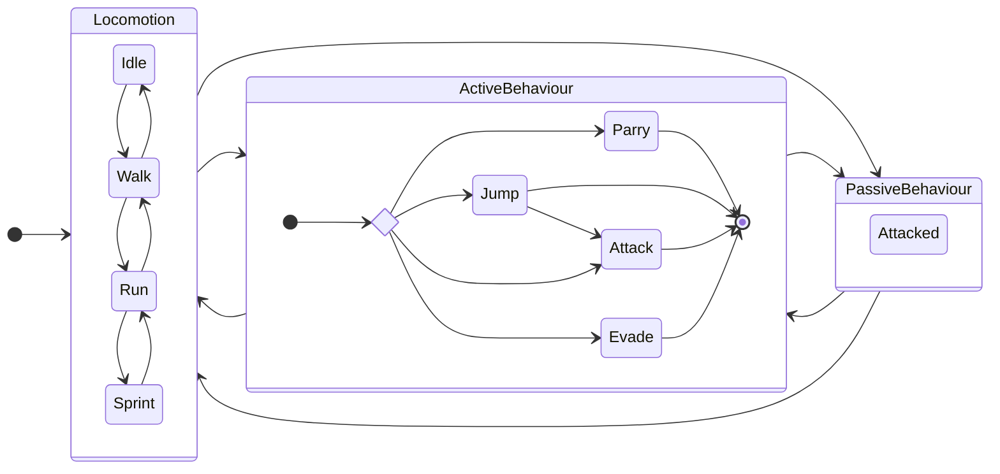

```mermaid
stateDiagram-v2

[*] --> Locomotion

Locomotion --> ActiveBehaviour
Locomotion --> PassiveBehaviour

ActiveBehaviour --> Locomotion
ActiveBehaviour --> PassiveBehaviour

PassiveBehaviour --> ActiveBehaviour
PassiveBehaviour --> Locomotion

direction LR

state Locomotion {    
    Idle --> Walk
    Walk --> Idle
    Walk --> Run
    Run --> Walk
    Run --> Sprint
    Sprint --> Run
}

state ActiveBehaviour {
    direction LR
    state if <<choice>>

    [*] --> if
    if --> Parry
    if --> Jump
    Jump --> Attack
    if --> Attack
    
    if --> Evade
    

    Parry --> [*]
    Jump --> [*]
    Attack --> [*]
    Evade --> [*]
    
}

state PassiveBehaviour {
    Attacked
}

```