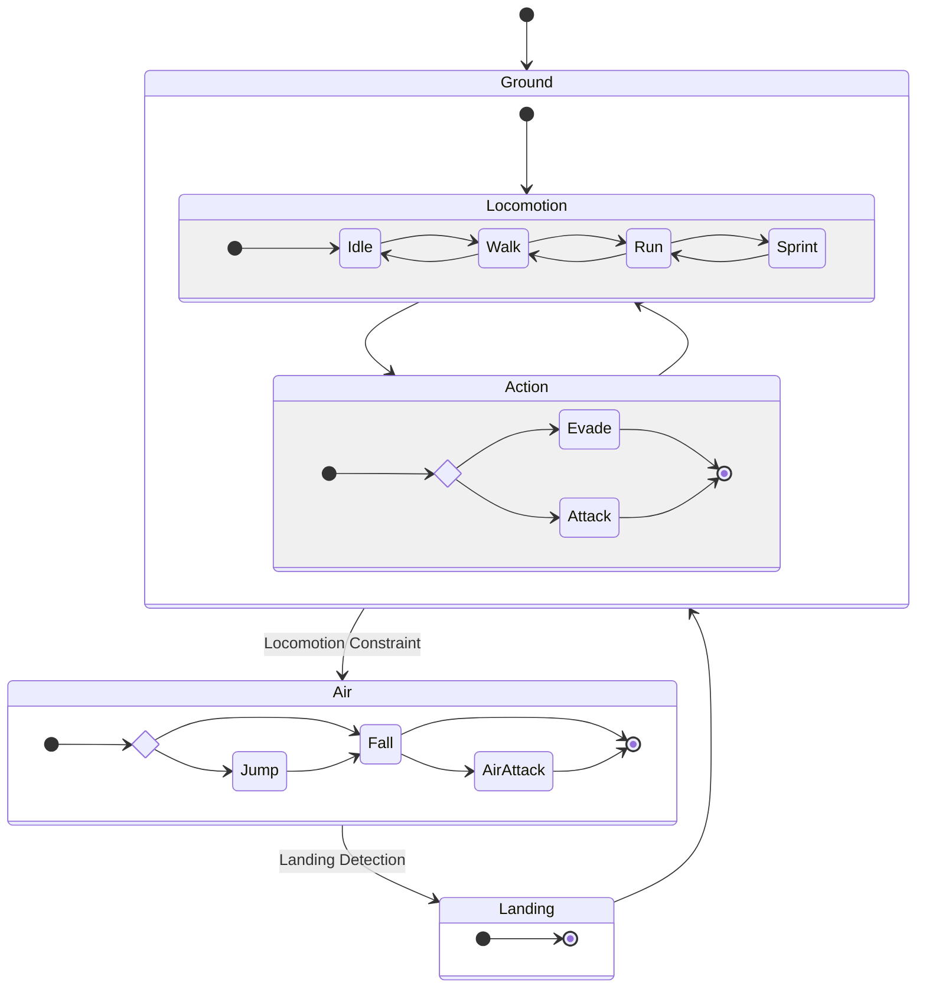

```mermaid
stateDiagram-v2

[*] --> Ground
Ground --> Air : Locomotion Constraint
Air --> Landing : Landing Detection
Landing --> Ground

state Ground {
    [*] --> Locomotion
    Locomotion --> Action
    Action --> Locomotion

    state Locomotion {
        direction LR
        
        [*] --> Idle
        Idle --> Walk
        Walk --> Idle
        Walk --> Run
        Run --> Walk
        Run --> Sprint
        Sprint --> Run
    }

    state Action {
        direction LR
        state Action_if <<choice>>
        [*] --> Action_if
        Action_if --> Evade
        Action_if --> Attack
        Evade --> [*]
        Attack --> [*]
    }
}

state Air {
    direction LR
    state Air_if <<choice>>
    [*] --> Air_if
    Air_if --> Jump
    Air_if --> Fall
    Jump --> Fall
    Fall --> AirAttack
    Fall --> [*]
    AirAttack --> [*]
}

state Landing {
    direction LR
    [*] --> [*]
}

```